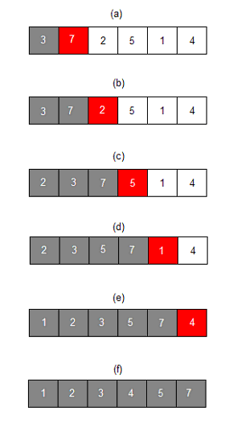
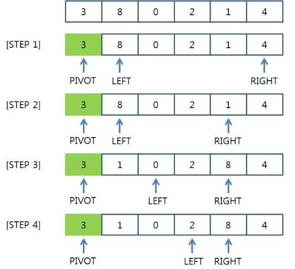
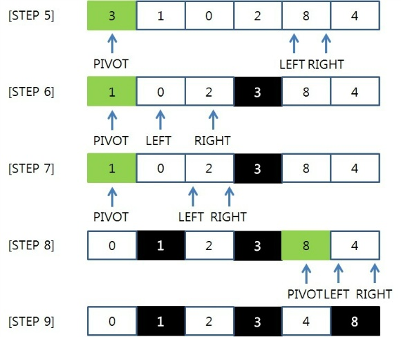

# Day2

## 학습 주제: 알고리즘

```
정렬
 ├ 선택법: 힙 정렬
 ├ 삽입법: 삽입 정렬, 쉘 정렬
 ├ 교환법: 버블 정렬, 선택 정렬, 퀵 정렬
 ├ 병합법: 머지 정렬
 └ 분배법: 기수 정렬(Radix Sort)

```

## Insert Sort

이미 정렬된 리스트의 값들과 크기를 비교한 후, 알맞은 위치에 `삽입`하는 정렬 방법.


n개의 원소가 있는 배열에서 i번째 원소를 정렬한다고 가정해보자.
0 ~ (i-1) 번째까지의 원소들은 이미 정렬되어 있다고 가정한다.
자신보다 작은 원소가 나올 때 까지 이전 원소들과 비교를 한다.
비교를 통해 삽입 할 인덱스가 정해지면 자신보다 큰 원소들을 1칸씩 뒤로 이동시키고 삽입한다.
</br>

- 시간복잡도: O(n^2)
  > 최악의 경우 정렬된 원소들과 모두 비교할 수 있음</br>
        1 + 2 + 3 + ... + (n-1)
- 공간복잡도: O(n)
  > 하나의 배열 안에서 정렬 진행

## Bubble Sort

서로 옆에 있는 두 원소를 차례로 비교하고 대소관계가 맞지 않으면 원소의 위치를 바꾸는 정렬 방식.
1회전을 할 때 마다 가장 큰 값을 맨 끝으로 이동시키게 된다.

- 시간복잡도: O(n^2)
- 공간복잡도: O(n)

## Selection Sort

이름 그대로 원소를 넣을 인덱스를 먼저 `선택`하고 그자리에 맞는 값을 찾는 정렬 방법.


선택한 inedx가 0이라고 가정해보자.
배열을 한번 search하면서 가장 작은 원소 값을 찾고, 0번째 원소와 swap한다.

- 시간복잡도: O(n^2)
- 공간복잡도: O(n)

## Quick Sort

원소들 중에 같은 값이 있는 경우 같은 값들의 정렬 이후 순서가 초기 순서와 달라질 수 있어 불안정 정렬에 속한다.




1. 배열에서 하나의 원소를 고른다.(pivot)
2. 피벗 앞에는 피벗보다 값이 작은 모든 원소들이 오고, 피벗 뒤에는 피벗보다 값이 큰 모든 원소들이 오도록(`정복`) 피벗을 기준으로 리스트를 둘로 나눈다.(`분할`)분할을 마친 뒤에 피벗은 더 이상 움직이지 않는다.
3. 분할된 두 개의 작은 리스트에 대해 재귀(Recursion)적으로 이 과정을 반복한다. 재귀는 리스트의 크기가 0이나 1이 될 때까지 반복된다.

- 시간복잡도: O(nlogn) / 최악: O(n^2)
- 공간복잡도: O(n)
