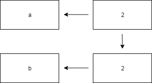
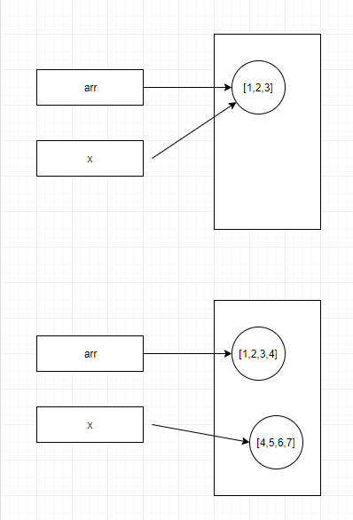
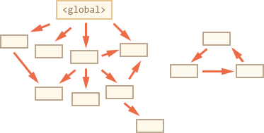
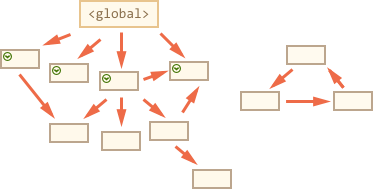

# 자바스크립트

**Contents**

- [Javascript Engine](#Javascript-Engine)
- [Call Stack](#Call-Stack)
- [Task Queue와 Event Loop](#Task-Queue와-Event-Loop)
- [원시 타입(Primitive Type)](#원시-타입Primitive-Type)
- [객체(Object)](#객체Object)
- [값 vs 레퍼런스 복사](#값-vs-레퍼런스-복사)
- [Garbage Collection](#Garbage-Collection)
- [스코프](#스코프)
- [호이스팅](#호이스팅)
- [클로저](#클로저)

</br>

## Javascript Engine

js를 해석하는 `javascipt engine`과 `rendering engine`은 다른 것이다.
javascipt engine은 js코드를 해석하고 실행하는 인터프리터로 V8, 라이노 등이 있다.

V8같은 js엔진은 단일호출스택(call stack)을 사용하며 요청이 들어올 때 마다 요청을 call stack에 담아 처리할 뿐이다. 비동기 요청은 이 js엔진을 구동하는 환경, 즉 브라우저나 node.js가 담당한다.


Node.js 환경도 브라우저 환경과 비슷하게 `libuv`라이브러리가 이벤트루프를 지원한다. js engine(V8)은 비동기 작업을 위해 node.js의 api를 호출하고, 이때 넘겨진 콜백은 libuv의 이벤트루프를 통해 스케줄 되고 실행된다.

</br>

## Call Stack

js는 하나의 호출스택을 사용한다. 요청이 들어오면 순서대로 call stack에 쌓이고 함수의 실행이 끝나면 pop된다. 콜스택이 한개이기 때문에 함수가 실행되면 이 함수가 끝나기 전까지는 어떠한 다른 작업도 할 수 없다. (Run to Completion)

</br>

## Task Queue와 Event Loop

js에서 모든 비동기 api는 작업이 완료되면 콜백함수를 task queue에 추가한다.
이벤트루프는 현재 실행중인 task가 없는지, task queue에 task가 있는지를 반복적으로 확인한다.
콜스택이 비워진 것을 확인하면 이벤트 루프가 task queue의 task를 실행해 콜스택에 추가한다.

### Promise와 Event Loop

Promise는 microtask를 사용한다. microtask는 일반 task보다 더 높은 우선순위를 갖는 task이다. Task Queue에 이미 대기중인 task가 있어도 microtask가 먼저 실행된다.

```js
setTimemout(() => {
  console.log("A");
});
Promise.resolve()
  .then(() => {
    console.log("B");
  })
  .then(() => {
    console.log("C");
  });
```

</br>

## 원시 타입(Primitive Type)

자바스크립트에는 6가지 종류의 원시 데이터 타입이 있다. 원시 데이터 타입은 쉽게 말하자면 자바스크립트에서 **객체가 아닌 것들**이며 **값 그 자체로 저장**된 것 이다. 마치 atom과 같다.

- boolean
- null
- undefined
- number
- string
- symbol

원시 타입은 값(value)으로 저장되고, 객체들은 참조(reference)로 저장된다. 아래 배열과 객체는 내용은 같지만 다른 곳을 참조하고 있기 때문에 false를 리턴.

```js
"dog" === "dog";                        // true
14 === 14;                              // true

{} === {};                              // false
[] === [];                              // false
(function () {}) === (function () {});  // false
```

</br>

### 객체(Object)

객체는 원시타입은 아니지만 자바스크립트의 타입값 중 하나이다.


### 내장객체

내장 객체란 자바스크립트가 기본적으로 가지고 있는 객체들을 의미한다. 내장 객체가 중요한 이유는 프로그래밍을 하는데 기본적으로 필요한 도구들이기 때문이다.

**Native 객체**

- Object
- Function
- Array
- String
- Boolean
- Number
- Math
- Date
- RegExp

```js
var a = new String("Abc");

typeof a; // "object"     !!string이 아니다!!
```

네이티브는 `생성자` 처럼 사용할 수 있지만 실제로 생성되는 결과물은 `원시 값(primitive)를 감싼 객체(object) 래퍼` 입니다.
**자바스크립트는 원시값을 알아서 해당 네이티브로 `박싱`해주기 때문에 다음과 같은 코드가 가능하다.**
원시 값에서 바로 객체 레퍼의 함수를 사용할 수 있다.

```js
var a = "abc";
a.length; // 3
a.toUpperCase(); // "ABC"
```

[reference](https://poiemaweb.com/js-built-in-object)

</br>

## 값 vs 레퍼런스 복사

자바스크립트는 원시타입을 복사할 땐 값복사, 객체는 레퍼런스 복사를 한다.

### 값복사

```js
var a = 2;
var b = a;
b++;

a; // 2
b; // 3
```

b에 a의 2라는 값이 복사되어 초기화된다.



b의 값을 변경하면 b의 값만 3이 된다.
이렇게 두개의 변수가 완전히 독립성을 갖는 것을 값 복사 또는 깊은 복사 라고 한다.

### 레퍼런스 복사

```js
var origin = [1, 2, 3, 4];
var copy = origin;
var obj = [1, 2, 3, 4];

origin[0] = 100;
origin; // [100, 2, 3, 4]
copy; // [100, 2, 3, 4]

console.log(origin == obj); // false
console.log(origin == copy); // true
```


origin은 배열의 시작원소 위치를 참조한다.(0x10) copy도 origin의 위치를 참조한다. (0x10)
두 변수는 같은 메모리 위치를 참조하기 때문에 독립적이지 않다.

```js
function foo(x) {
  x.push(4);
  x; // [1,2,3,4]

  x = [4, 5, 6];
  x.push(7);
  x; // [4,5,6,7]
}

var arr = [1, 2, 3];
foo(arr);
arr; // [1,2,3,4]
```

arr을 인자로 넘기면 arr의 레퍼런스 사본이 x에 할당된다.
하지만 그 후 x = [4,5,6] 으로 새 값을 할당해도 초기 레퍼런스 arr가 참조하고 있던 값에는 아무런 영향이 없다. arr레퍼런스는 여전히 [1,2,3,4] 값을 바라보고 있다.



</br>

## Garbage Collection

가비지 콜렉션은 자바스크립트 엔진의 백그라운드 프로세스로 동작한다. 가비지 콜렉션은 모든 객체들을 모니터링 하며 그것들이 접근 불가능하게 되었을 때 삭제하는 작업을 수행한다.

기본적인 가비지 콜렉션의 알고리즘은 `마크 앤 스윕(Mark-and-sweep)` 이라고 불린다.

- 가비지 콜렉터는 루트를 획득하여 그들을 마크(기억)합니다.
- 그리고 그들이 참조하고 있는 모든 것들에 방문하여 마크합니다.
- 그리고 마크한 모든 객체에 방문하여 그들의 참조 역시 마크합니다.
- 모든 객체들을 기억하고 나면 미래에는 같은 객체를 두번 방문하지 않습니다.
- 루트로부터 접근 가능한 방문하지 않은 참조가 있다면 계속해서 반복합니다.
- 마크되지 않은 모든 객체는 삭제됩니다.

</br>
</br>





루트가 참조하고 있는 모든 객체에 방문해 마크한다.


마크한 객체가 참조하는 것들도 마크한다.


가능할 때 까지 마킹을 한다.


방문이 불가능한(`unreachables`) 객체들은 접근 불가능한 것으로 간주되어 삭제한다.

- 가비지 콜렉션은 자동으로 실행된다.
- 객체는 그들이 접근 가능한 동안 메모리에 유지된다.
- 참조가 된다는 것이 루트(Root)에서 참조 가능한것과 같은 말은 아니다 : 상호 참조하고 있는 객체들이 전체에서 보면 참조 불가능할 수 있다.

[reference](http://theeye.pe.kr/archives/2872)
</br>

## 스코프

스코프는 어디서 어떻게 변수(확인자, 식별자?)를 찾는가를 결정하는 규칙의 집합이다. js는 이 규칙대로 식별자를 찾는다. 식별자는 자신이 어디에서 선언됐는지에 의해 자신이 유효한(다른 코드가 자신을 참조할 수 있는) 범위를 갖는다.

> 스코프가 없다면 같은 식별자 이름은 충돌을 일으키므로 프로그램 전체에서 하나밖에 사용할 수 없다.

```
스코프
 ├ 작동 방식 ┬ 렉시컬 스코프
 |           └ 동적 스코프
 |
 └ 종류 ┬ 전역 스코프
        └ 지역 스코프 ┬ 함수 스코프
                      └ 블록 스코프

```

스코프는 크게 `전역 스코프`와 `지역 스코프`로 나눌 수 있다.

전역 스코프를 갖는 전역 변수는 전역(코드 어디서든지)에서 참조할 수 있다. 지역(함수 내부)에서 선언된 지역 변수는 그 지역과 그 지역의 하부 지역에서만 참조할 수 있다.

또한 자바스크립트에는 두가지 지역 스코프가 존재한다. `함수 스코프`와 `블록 스코프` 이다.

함수 scop는 함수 단위로 범위를 지정한다. 블록 scope 는 중괄호{} 단위로 범위를 지정한다.(let, const, try-catch)

`렉시컬 스코프`는 Lexing Time에 정의되는 스코프로, 함수를 어디서 호출하는지가 아니라 어디서 선언하였는지 에따라 정의되는 스코프이다. 렉싱단계에서 모든 확인자가 어디서 어떻게 선언되었는지를 파악해 실행단계에서 어떻게 확인자를 검색할지 예상할 수 있도록 도와준다.

### 자바스크립트의 컴파일 과정

자바스크립트 엔진은 코드를 실행하기 직전에 컴파일을 하는데, 이과정에서 엔진은 `var a = 2`라는 구문을 다음과 같이 두단계로 나눈다.

1. `var = a`: 변수 a를 해당 스코프에 선언한다. 이 단계는 코드 실행 전에 처음부터 수행된다. (컴파일 단계에서 처리)
2. `a = 2`는 변수 a를 찾아 값을 대입한다.(실행 단계에서 처리)

**더 자세한 설명**
컴파일러가 `var a`를 만나면 스코프에게 변수 a가 특정한 스코프 컬렉션 안에 있는지 묻는다. a가 있다면 지나가고 없다면 a를 스코프 컬렉션 내에 선언하라고 요청한다.

그 후 컴파일러는 `a=2`대입문을 처리하기 위해 나중에 js엔진이 실행할 수 있는 코드를 생성한다. 엔진이 실행하는 코드는 먼저 스코프에게 a변수가 현재 스코프 컬렉션 내에서 접근 할 수 있는지 확인한다. 가능하다면 현재 스코프 내의 a를 사용하고 아니면 엔진은 상위 스코프를 살핀다.

</br>

## 호이스팅

호이스팅이란 컴파일 시점에서 변수(var)와 함수 `선언문`을 실행 문맥(컨텍스트)/스코프? 에 저장하고 이후 코드가 실행되는 것을 말한다. (실행단계에서 초기화가 이루어진다.)

그래서 흔히 변수(var)와 함수 `선언문`을 스코프의 최상단으로 `끌어올려`지는 것이라 말한다. 실제로 코드가 끌어올려지는 것은 아니고 자바스크립트가 내부적으로 끌어올려서 처리하는 것이다. 실제 메모리엔 변화가 없다.

**함수선언문 vs 함수표현식**

```js
foo();
bar();

function foo() {
  console.log("foo");
} //함수 선언문

var bar = function() {
  console.log("bar");
}; //함수표현식

// Uncaught TypeError: bar is not a function
```

```js
/** --- JS Parser 내부의 호이스팅(Hoisting)의 결과 */
var foo2; // 함수표현식의 변수값 "선언"문이 호이스팅됨

function foo() {
  // 함수선언문이 호이스팅 됨
  console.log("hello");
}

foo();
foo2(); // ERROR!!

foo2 = function() {
  console.log("hello2");
};
```

호이스팅은 함수선언문과 함수표현식에서 서로 다르게 동작한다.
변수에 할당된 함수표현식은 끌어 올려지지 않기 때문에 변수의 스코프 규칙을 그대로 따른다.

[스코프와 호이스팅](https://meetup.toast.com/posts/86)

</br>

## 클로저

특정 함수가 참조하는 변수들이 선언된 렉시컬 스코프(lexical scope)는 계속 유지되는데, 그 함수와 스코프를 묶어서 클로저라고 한다.
클로저가 나타나는 가장 기본적인 환경은 함수 안에 함수가 선언되었을 때. 즉, 스코프 안에 스코프가 있을 때.

### 클로저는 언제 사용할까?

- private 변수
- 함수 콘텍스트 바인딩하기
- 메모제이션, 함수 래핑 ...

```js
// 클로저를 이용해 private 변수 만들기

function Toy() {
  var battery = 0;

  this.showBattery = function() {
    return battery;
  };

  this.charge = function() {
    battery += 10;
  };
}

var woody = new Toy();
woody.charge();

if (woody.showBattery() == 10)
  console.log("생성자 함수 내부에 있는 battery변수 값은 얻어올 수 있다.");

if (woody.bttery === undefined)
  console.log("하지만 private변수에 직접 접근은 불가능 하다");
```

## 프로토타입

```js
function Foo() {}
```

함수를 정의하면 함수만 생성되는 것이 아니라 `Prototype Object`도 같이 생성이 된다.


Prototype Object는 기본속성으로 `constructor`와 `__proto__`를 가지고 있다. (따라서 정확히 말하자면 Foo.prototype 객체가 프로토타입을 의미하는것은 아니다. constructor도 가지고 있으니! )

- **constructor**는 내가 선언한 생성자 함수(Foo)를 가리킨다. new 키워드와 함께 함수를 호출할 경우 constructor함수를 실행하고 부수효과로 "객체"가 생성된다.

- **prototype**은 생성자 함수에 정의한 모든 객체가 공유할 **원형**이다.
- `__proto__`는 [[Prototype]]링크이다. 생성자 함수에 정의해두었던 prototype을 참조한다.

```js
const f = new Foo();
Object.getPrototypeOf(f) === Foo.prototype; // true
```


`prototype`은 생성자 함수에 사용자가 직접 넣는 거고, `__proto__` 는 new를 호출할 때 prototype을 참조하여 자동으로 만들어진다.

생성자 함수에는 `prototype`에, 생성자로부터 만들어진 객체에는 `__proto__`에 생성자의 prototype이 들어간다.

`new` Foo()로써 만들어진 모든 객체(`f`)는 결국 **Foo.prototype 객체**와 내부적으로 **[[Prototype]]링크**로 연결된다.
**결국 `f` 와 `Foo` 는 상호 연결된 두개의 객체가 된다.**


### new 연산자

객체지향언어에서 클래스를 인스턴스화 하기 위해 `new 연산자`를 사용한다. 그리고 자바스크립트에서도 두개의 객체를 연결하기 위해 new연산자를 사용한다.

하지만 전자의 경우 클래스로부터 작동을 **복사**하여 새로운 객체를 만드는 것이고, 후자의 경우 복사 과정 없이 **그저 두 객체를 연결**한 것이 전부이다.
따라서 자바스크립트의 new 키워드는 우리가 흔히 아는 new키워드와 다르게 동작한다는걸 알 수 있다.

js에서 new연산자는 결국 **새 객체를 다른 객체와 연결하기 위한 간접적인 우회 방법**이고, `Object.create()`를 이용해 직접적으로 객체를 연결해주는 방법도 있다.

> **[[Prototype]] 체계**를 흔히들 **프로퍼타입 상속**이라고 부른다. 하지만 상속은 기본적으로 **복사**를 수반하지만, 자바스크립트는 객체 프로퍼티를 복사하지 않는다. 따라서 프로퍼타입 상속은 의미를 더 햇갈리게 만드는 단어의 조합이고, `위임`이야말로 자바스크립트 객체-연결 체계를 훨씬 더 정확하게 나타내는 용어라고 할 수 있다.

### 생성자

앞 예제에서 new를 붙여 Foo함수를 호출하여 객체가 "생성"되는 현장을 목격했으니 Foo를 생성자라고 믿고 싶은 욕망을 버리기란 쉽지 않다.

하지만 Foo는 생성자가 아니다. 그저 **함수**일 뿐이다.

함수는 결코 생성자가 아니지만 new를 붙여 호출하는 순간 이 함수는 `생성자 호출`을 한다. `new키워드`는 일반 함수 호출 도중에 원래 수행할 작업 외에 `객체 생성`이라는 잔업을 더 부과하는 지시자인 것이다.

```js
function nothing() {
  console.log(`그저 함수입니다`);
}

const a = new nothing();
// "그저 함수입니다"
a; // {}
```


평범한 함수인 nothing을 new로 호출함으로써 **_객체가 생성_** 되고 부수효과로 생성된 그 객체를 a에 할당하는 것이다. 이것을 보통 생성자(constructor) 호출 이라고 부르지만 nothing함수 자체는 생성자가 아니다.

즉, 자바스크립트는 앞에 new를 붙여 호출한 함수를 모두 **생성자**라고 할 수 있다. 함수는 결코 생성자가 아니지만 new를 사용하여 호출할 때에만 **생성자 호출**이다.

### 정리

객체에 존재하지 않는 프로퍼티를 접근하려 시도하면 해당 객체의 내부 [[Prototype]] 링크를 따라 다음 수색 장소를 결정한다. 모든 일반 객체의 최상위 프로토타입 연쇄는 내장 `Object.prototype`이고 이 지점에서도 찾지 못하면 탐색이 종료된다.

두 객체를 서로 연결짓는 가장 일반적인 방법은 함수 호출 시 `new`키워드를 앞에 붙이는 것이다.
new키워드는 `일반 함수 호출 + "객체" 생성`이라는 잔업을 더 부과하는 지시자이다.
`const f = new Foo()`를 실행하면 Foo 함수가 실행되고, 객체가 생성되어 변수 f
에 할당된다.

```
typeof f // object
typeof Foo //function
```

- `constructor`는 생성자 함수 그 자체를 가리킴
- `prototype`은 생성자 함수에 정의한 모든 객체가 공유할 원형
- `__proto__`는 생성자 함수를 new로 호출할 때, 정의해두었던 prototype을 참조한 객체
- prototype은 생성자 함수에 사용자가 직접 넣는 거고, **proto**는 new를 호출할 때 prototype을 참조하여 자동으로 만들어짐
- 생성자에는 prototype, 생성자로부터 만들어진 객체에는 **proto**
- 따라서 사용자는 prototype만 신경쓰면 된다. **proto**는 prototype이 제대로 구현되었는지 확인용으로 사용한다.
