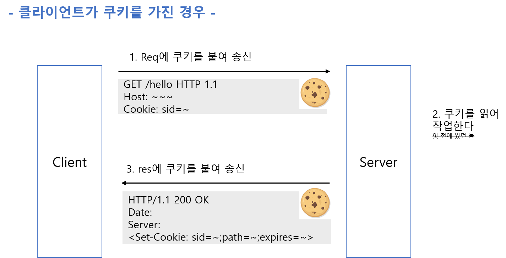

# 네트워크

- [TCP/IP](#TCP/IP)
- [IP(Internet Protocol)](<#IP(Internet-Protocol)>)
- [TCP](#TCP)
  - [3-way-handshaking](#3-way-handshaking)
- [HTTP](#HTTP)
  - [STATELESS](#상태를-계속-유지하지-않는-STATELESS-프로토콜이다)
  - [지속 연결](<#지속-연결(persistent-connection)로-접속량-절약>)
  - [Cookie](#Cookie를-사용한-상태-관리)
  - [HTTP 메세지 인코딩](#HTTP-메세지-인코딩)\
  - [Multipart](Multipart)
  - [웹 서버](#웹-서버)
- [HTTPS](<#HTTP-+-S(Secure)>)

## TCP/IP

TCP/IP는 IP프로토콜을 사용하는 인터넷 통신에서 사용되고 있는 프로토콜의 집합이다.
총 4계층으로 계층화되어 있다.

> WHY? 마치 MSA처럼 여러 계층을 둠으로써 바꾸고 싶은 계층의 로직만 바꿀 수 있고 설계가 편한 장점이 있기 때문

## IP(Internet Protocol)

개개의 패킷을 목적지까지 배송하는 역할을 한다.\
수신지의 MAC주소를 추가한다. --> 이건 링크 계층에서 하는거 아닌가?

IP통신은 수신지의 IP주소를 바탕으로 ARP()를 사용해 다음으로 중계할 곳의 MAC주소를 사용해 목적지까지 찾아간다.

## TCP

### 3-way-handshaking

클라이언트(어플리케이션)가 Socket Library에게 소캣 생성을 요청한다. 소켓 라이브러리는 소켓을 생성하고 소켓을 구별할 수 있는 `디스크립터`를 어플리케이션에게 반환한다.

`connect(<디스크립터>, 서버ip, 서버 port)`를 실행하면 소켓간 연결을 시도한다.
서버의 소켓과 제어정보(TCP헤더)를 주고 받아 서로의 소켓에 필요한 정보들을 저장해 송수신이 가능한 상태로 만든다.

## HTTP

### 상태를 계속 유지하지 않는 STATELESS 프로토콜이다

이전에 보낸 response, request를 기억하지 않는다.

> why? 통신간 연결 상태 처리, 진행중인 송수신에 관한 state 저장 등을 관리할 필요가 없어서 서버 디자인이 간단하고 확장이 용이하기 때문

### 지속 연결(persistent connection)로 접속량 절약

하나의 HTML문서에 여러개의 이미지가 포함되어 있다고 가정해보자. 클라이언트는 html코드를 받아온 뒤 이미지를 획득하기 위해 추가로 여러 request를 보내야 한다.
또한 HTTP 초기버전에는 한번 통신할 때 마다 TCP 커넥션을 생성하고 해제했기때문에 다량의 request를 보낼 경우 통신량이 늘고 오버헤드가 생겼다.

> 왼쪽 그림처럼 한번 http통신이 끝나면 커넥션을 닫고 다시 커넥션을 열어 통신을 했다.

이런 문제를 해결하기 위해 어느 한 쪽이 명시적으로 연결을 종료하지 않는 이상 TCP연결을 유지하는 `지속 연결`이라는 방법이 생겼다.

HTTP 1.0에서는 `Connection: keep-alive`라는 헤더를 붙여줘야지만 지속 연결을 사용할 수 있다.
HTTP 1.1부터는 지속 연결이 디폴트이다.

반복적인 TCP 커넥션 연결과 종료로 인한 오버헤드를 줄여주어 서버 부하가 낮아지고 HTTP통신이 빨라지는 장점이 있다.

또한 지속연결은 RESPONSE를 기다리지 않고 여러 REQUEST를 보낼 수 있도록 HTTP 1.1부터 `파이프라이닝`을 지원한다.

파이프라이닝이 적용되면, 하나의 Connection 으로 다수의 Request 와 Response 를 처리할 수 있게끔 Network Latency 를 줄일 수 있다.

하지만 완전한 멀티플렉싱이 아닌 응답처리를 미루는 방식이므로 각 응답의 처리는 순차적으로 처리되며, 결국 후순위의 응답은 지연될 수 밖에 없다. HTTP 파이프라이닝은 HTTP/2 가 등장하면서 멀티플렉싱 알고리즘으로 대체되었고, 모던 브라우저들에서도 기본적으로는 활성화하지 않고 있다

### Cookie를 사용한 상태 관리

HTTP는 Stateless Protocol이다. 수많은 클라이언트들의 상태를 서버가 전부 관리하는 것은 매우 힘들고 리소스 낭비가 심하다.

HTTP의 Stateless 특징을 남겨둔 채 클라이언트의 상태를 파악하기 위해서 Cookie를 도입하였다.

### HTTP 메세지 인코딩

**1. Content Coding**

엔티티 정보를 작게 압축하여 전송한다.

gzip, compress, deflate, identity

**2. Chuncked Transfer Coding**

엔티티 바디를 청크로 분해해 송신한다.

> 엔티티란 무엇인가?

### Multipart

HTTP 메세지 Body 내부에 엔티티를 여러개 포함시켜 여러 종류의 데이터를 송신할 수 있도록 한다.

**1. multipart/form-data**

web폼으로부터 파일 업로드에 사용

**2. multipart/bytearanges**
상태코드 `206` response message가 복수 범위의 내용을 포함할 때 사용한다.

## 웹 서버

### Proxy

서버와 클라이언트 사이에서 req, res를 전송한다. 프록시서버를 여러개 경유하는 것도 가능하다(Via 헤더 필드)

> why? 캐싱을 위해, 특정 웹사이트에 대한 엑세스 제한을 위해 사용

**캐싱 프록시**

response 중계시 프록시 서버 상에 resource 캐시를 보관하는 프록시. 같은 resource에 대해 request가 온 경우 오리진 서버에게 응답 요청을 하지 않고 프록시에서 캐시를 response로 돌려준다.

**투명 프록시**

req, res 중계시 메세지를 변경하지 않는 프록시.

### Gateway

프록시와 유사하게 동작하며 HTTP 이외의 통신을 하는 서버와 통신한다.

### 터널

client는 SSL과 같은 암호화 통신을 통해 서버와 안전하게 통신하기 위해 터널을 사용한다.

## HTTP + S(Secure)

HTTPS는 HTTP의 문제점을 보완하기 위해 나온 프로토콜이다. HTTP의 보안적인 문제점은 다음과 같다.

1. 평문 통신이기 때문에 도청이 가능하다.
2. 통신 상대를 확인하지 않기 때문에 위장이 가능하다.
3. 완전성을 증명할 수 없기 때문에 변조가 가능하다.

SSL 인증서를 사용하면 암호화를 통해 문제를 보완할 수 있다.

---

## SSL

SSL 인증서는 클라이언트와 서버 간의 통신을 제3자가 보증 해주는 전자화 된 문서다. 클라이언트가 서버에 접속한 직후에 서버는 클라이언트에게 이 인증서 정보를 전달한다. 클라이언트는 받은 인증서를 신뢰할 수 있는지 검증한 후에 사용한다.

SSL 인증서는 신뢰할 수 있는 서버임을 알려주는 동시에 SSL 통신에 사용할 공개키를 클라이언트에게 제공한다.

### 인증서에는 어떤 내용이 있나

1. 서비스의 정보 (인증서를 발급한 CA, 서비스의 도메인 등등)
2. 서버 측 공개키 (공개키의 내용, 공개키의 암호화 방법)

### 서버가 모든 요청에 대해서 자신의 공개키를 준다면

모두가 공개키를 요청하고 받을 수 있다는 것은, 서버가 비밀키로 암호화한 데이터를 누구나 볼 수 있다는 뜻이다. 이렇게 된다면 암호화의 의미가 없기 때문에 서버가 암호화한 데이터를 다른 사람이 해독할 수 없는 키를 사용해야 한다.

클라이언트가 서버에 처음 요청을 보낼 때, 3가지 정보를 서버에게 준다.

1. 클라이언트 측에서 생성한 랜덤 데이터(nonce)
2. 클라이언트가 지원하는 암호화 방식들
3. 세션 아이디 (이미 SSL 연결을 했다면 기존의 세션을 재활용)

이에 대해서 서버는 다음과 같은 정보를 응답한다.

1. 서버 측에서 생성한 랜덤 데이터(nonce)
2. 서버가 선택한 클라이언트의 암호화 방식
3. 인증서

서버로 부터 인증서를 받았을 때, 그 인증서가 올바른 인증서인 것을 판단해야 한다. 인증서가 중간에 위조되지 않았다는 것은, 브라우저가 이미 알고 있는 CA에 대한 공개키로 복호화가 잘 되는 것으로 확인할 수 있다.

아래의 그림을 본다면, Digitally Signed Document가 SSL 인증서이고, 브라우저가 이미 알고 있는 CA에 대한 공개키는 Decryption할 때 쓰이는 Public Key 이다.

### 인증서 안에 있는 공개키를 받긴 받았는데

이제 받은 공개키와 랜덤 데이터 값들을 이용해서 클라이언트와 서버만 암호화/복호화 할 수 있도록 해야한다.

클라이언트는 자신이 생성한 랜덤 데이터와 서버에게서 받은 랜덤 데이터를 조합해 premaster secret이라는 데이터를 만든다. 그리고 서버의 공개키로 premaster secret을 암호화해서 서버에게 보낸다.

서버는 자신의 공개키로 암호화된 premaster secret을 복호화하고 premaster secret을 사용해서 대칭키를 만든다. 클라이언트도 같은 premaster secret으로 대칭키를 만들게 된다.

이제 서로 데이터를 주고 받을 때 대칭키를 사용하여 안전하게 통신한다.

---

## 랜덤 데이터(nonce)를 모두 알고 있다면

도청하는 해커가 클라이언트가 생성한 랜덤 데이터와 서버가 응답한 랜덤 데이터 모두를 알고 있다면 어떻게 될까. 만약 랜덤 데이터를 둘 다 알고 있더라도 premaster secret를 똑같이 만든다는 보장이 없다.(MD5와 SHA 모두를 활용한 발표된 공식을 이용한다.) 그리고 premaster secret 값은 서버의 공개키로 암호화되기 때문에 확인할 수 있다.

## 왜 굳이 premaster secret이 필요할까

대칭키를 만들기 위해서라면, 클라이언트가 난수를 생성하고 공개키로 암호화한 후 전송해서 클라이언트와 서버만 알 수 있는 값을 가지면 되는데, 왜 굳이 랜덤 데이터를 두 개 생성하고 다시 그것들을 조합하는 과정이 필요할까?

서버에서 클라이언트로 보내는 nonce 값을 복호화하는 것은 서버의 인증서를 받으면 모두가 할 수 있다. 암호화되지 않은 통신이라는 뜻인데, 이럴때 공통의 비밀 키를 공유할 수 있도록 하는 것이 Diffie–Hellman 키 교환이다. 자세한 것은 알 수 없지만 master secret을 만들기 위해서는 nonce가 두 개 필요하기 때문일 것이다.

> **_참고_** > [https://opentutorials.org/course/228/4894](https://opentutorials.org/course/228/4894) > [https://wayhome25.github.io/cs/2018/03/11/ssl-https/](https://wayhome25.github.io/cs/2018/03/11/ssl-https/) > [https://ko.wikipedia.org/wiki/디피-헬먼*키*교환](https://ko.wikipedia.org/wiki/%EB%94%94%ED%94%BC-%ED%97%AC%EB%A8%BC_%ED%82%A4_%EA%B5%90%ED%99%98) > [https://security.stackexchange.com/questions/89383/why-does-the-ssl-tls-handshake-have-a-client-and-server-random](https://security.stackexchange.com/questions/89383/why-does-the-ssl-tls-handshake-have-a-client-and-server-random)
